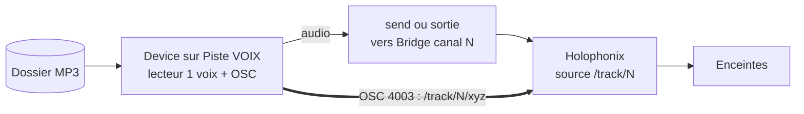

# Brief Claude Code › Device M4L « S·O·S Player » (Holophonix Native) v4 consolidé

Version finale, remplace v1 à v3. Simplifiée au maximum.

## Principe

1 piste = 1 voix = 1 source mono Holophonix. Le device posé sur la piste lit un dossier de messages, les joue un par un, et positionne sa source dans Holophonix par OSC. Pour jouer plusieurs messages en simultané, on **duplique la piste** : chaque instance est une voix indépendante avec sa propre source.

## Décisions verrouillées

- Source des messages : un **dossier de MP3 sur disque**, chemin passé en entrée. Le device lit et joue les fichiers.
- **1 voix par piste, 1 source mono Holophonix par piste.** Plus de logique 2 voix ni de crossfade interne. Simultanéité = pistes en plus.
- Positionnement : **snap sur une enceinte**, positions récupérées depuis Holophonix par OSC. Plus de bounding box.
- Coordonnées : **XYZ complet, en mètres**.
- Type de device : Max **audio effect**. Il génère l'audio du message et le sort sur sa piste (mono). Le device est la source, pas besoin de clip sur la piste.
- Audio : la piste route son son vers le canal Holophonix Bridge de sa source (send vers un return dédié, ou sortie directe de piste). Le device connaît son `source id` pour l'OSC.

## Topologie (une piste, à dupliquer)

Pour 2 voix simultanées : dupliquer la piste, instance 2 avec `source id` = 2, son audio vers Bridge canal 2, OSC vers `/track/2`. Et ainsi de suite.

## Rôle du device (par instance)

Au démarrage, interroger Holophonix par OSC pour la table des positions d'enceintes. Ensuite, en boucle :
1. tirer un message au hasard dans le dossier, différent du précédent,
2. tirer une enceinte au hasard, différente de la précédente,
3. envoyer ses XYZ à la source (`/track/{source_id}/xyz x y z`, triplet complet),
4. jouer le fichier (one-shot),
5. enchaîner le suivant après `durée_du_fichier + gap`.

## Paramètres (par instance)

- Chemin du **dossier** de messages.
- **source id** (détermine l'adresse OSC `/track/{id}` et, côté Live, le canal Bridge de routage audio).
- IP et **port Holophonix** (défaut 4003 en envoi), plus un port d'écoute local pour les réponses `/get`.
- **gap** entre messages (silence, réglable).
- Bouton « Rescan speakers », bloc test (forcer une enceinte), Play/Stop.

## Points OSC (vérifiés dans la doc Holophonix)

- Envoi vers Holophonix sur le port **4003** par défaut.
- Une source **mono** s'adresse en `/track/{index}/...` (préfixe `/track`, index à partir de 1).
- `/get` récupère la valeur d'un paramètre : c'est le mécanisme pour lire les positions d'enceintes au démarrage.
- L'adresse OSC exacte d'une enceinte et du paramètre de position source se lit dans la fenêtre **OSC Status** de Holophonix (sélectionner l'objet, copier adresse et valeur avec Shift+Ctrl+C). À figer dans le code après vérification.
- XYZ en mètres, Z de bas en haut.

## Références

- Liaison OSC : on écrit la nôtre. L'encodeur OSC maison de **`aker-dev/holophonix_export`** (OSC 1.0 sur UDP, ~30 lignes, sans dépendance) est la référence pour le format des messages.
- Coordonnées : **`aker-dev/holophonix_export`** est la source de vérité (fonction `to_holophonix`, XYZ en mètres, adresse enceinte `/speaker/{index}`). Le player travaille directement en repère Holophonix, sans swap d'axes.
- Observation seulement : device M4L officiel Holophonix et Holoscore VST3, pour voir comment ils procèdent. On n'en reprend pas le code.

## Compromis assumé

1 voix par piste implique des cuts entre messages consécutifs (pas de crossfade). Les queues de reverb Holophonix adoucissent la transition, à condition que le `gap` laisse la queue retomber avant que la source ne se repositionne, sinon la queue glisse avec la source. Un vrai crossfade entre messages consécutifs nécessiterait le modèle 2 voix, écarté ici pour la simplicité.

## Critères d'acceptation

1. Le device lit et joue les fichiers du dossier, tirage aléatoire sans répétition immédiate.
2. Au démarrage, la table des positions d'enceintes est remplie depuis Holophonix.
3. Chaque message se pose sur une enceinte réelle : en test, viser une enceinte fait sortir le son de cette seule enceinte.
4. Holophonix reçoit un triplet XYZ complet par message sur la bonne source.
5. Dupliquer la piste crée une voix simultanée indépendante, sans interférence entre instances.

## Hors scope v1, extensions v2

- Trajectoire animée (descente « vient du ciel ») : envoi d'un XYZ qui bouge sur la durée du message.
- Choix d'enceinte par thème du message (lu depuis le nom de fichier, code issu de la classification ThunderVox).
- Entrée temps réel foudre (OSC azimut).
- Paysage : boucles Live, hors device.

## Questions résiduelles

1. Routage du paysage (sources statiques Holophonix ou sortie directe Live), pour réserver les index de sources après les voix messages.
2. Valeur de `gap` de départ, à caler à l'oreille en fonction du temps de reverb.
3. Adresses OSC : préfixes confirmés via `holophonix_export` (`/track/{id}` pour la source, `/speaker/{index}` pour les enceintes). Reste à confirmer la sous-adresse de position (xyz) dans OSC Status.
